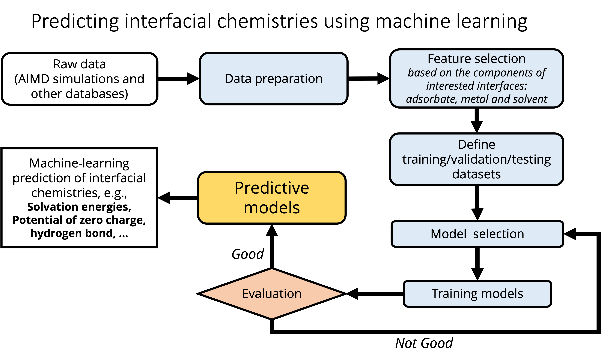

A machine learning working script to predict interfacial chemistries

## Dependency
- python
- numpy
- matplotlib
- sklearn
- pandas
- scipy

## input data
- an initio simulations, e.g., AIMD modeling
- data pre-analysis: AIMD
- see https://github.com/tjunewson/AIMDprobe

## Contributors
Sihang Liu

## Cite papers below for raw data
*Liu et al., Solvation of furfural at metal–water interfaces: Implications for aqueous phase hydrogenation reactions*
The Journal of Chemical Physics, 2023.

*Heenen et al., Solvation at metal/water interfaces: An ab initio molecular dynamics benchmark of common computational approaches.* 
The Journal of Chemical Physics, 2020.# ML_interfaces
